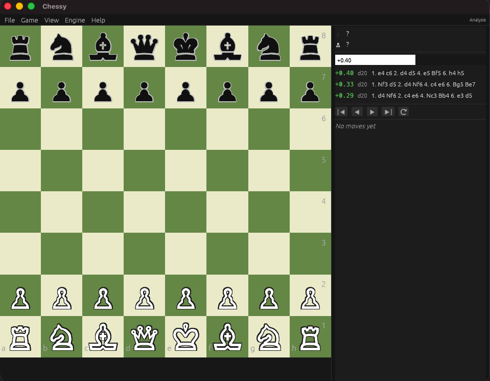

# Chessy

> A native chess GUI built with Rust, egui, and Stockfish.

<p align="center">
  
</p>

---

## Features

- Native desktop UI powered by [egui](https://github.com/emilk/egui)
- [Stockfish](https://stockfishchess.org/) engine integration with multi-line evaluation
- Evaluation panel with score, depth, and suggested move sequences
- PGN import/export
- Move history navigation

## Install

Download the latest build for your platform from [Releases](../../releases).

Stockfish must be installed separately: `brew install stockfish` (macOS), `sudo apt install stockfish` (Linux), or [download](https://stockfishchess.org/download/) (Windows).

### macOS

Open the DMG and drag **Chessy** to Applications. The app is not notarized (no paid Apple Developer account), so the first launch shows a Gatekeeper warning:

1. Double-click Chessy — macOS says it can't verify the app. Click **Done** (not "Move to Trash").
2. Open **System Settings → Privacy & Security**, scroll down, and click **Open Anyway**.
3. Confirm — this is only needed once.

Or skip the dialogs entirely with: `xattr -dr com.apple.quarantine /Applications/Chessy.app`

### Linux / Windows

Extract the archive and run `chessy` (or `chessy.exe`) from inside the extracted folder — the `assets/` directory must stay next to the binary.

## Build from source

| Requirement | Notes |
|---|---|
| Rust (2024 edition) | Install via [rustup](https://rustup.rs/) |
| Stockfish | Must be available in `$PATH` — [download](https://stockfishchess.org/download/) |

```sh
cargo run --release
```

## License

[LICENSE](LICENSE)
